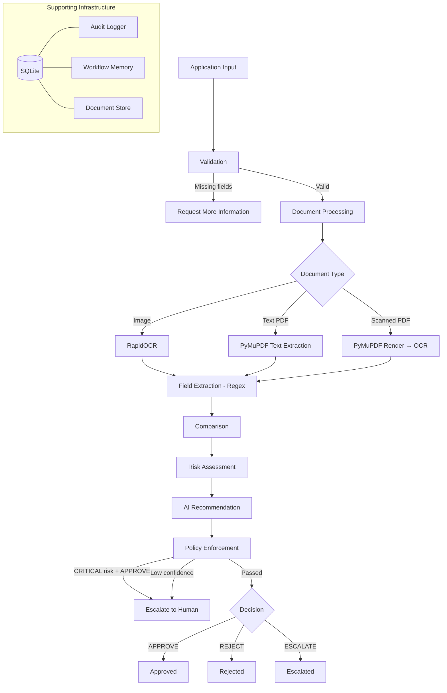

# Saksham — Autonomous Onboarding Verification Worker

## Problem Statement

Merchant and partner onboarding verification is a high-volume, error-prone process. Operations teams manually review documents, cross-check application data, assess risk, and make approval decisions. This creates bottlenecks, inconsistencies, and fatigue-driven errors. Saksham automates this pipeline — validating submissions, extracting evidence from documents, detecting inconsistencies, assessing risk, and producing controlled decisions — while escalating cases that cannot be safely resolved autonomously.

## Why This Is an AI Worker (Not a Chatbot)

Saksham is not a conversational assistant. It is an autonomous verification pipeline with a fixed state machine, bounded retries, and non-negotiable safety policies. It receives applications, processes documents through OCR and field extraction, compares declared information against verified evidence, and reaches a deterministic decision. The LLM is one advisory input — not the decision authority. Policy rules override all recommendations.

## Goal

Reduce manual effort in onboarding verification by automatically validating application information, extracting evidence from submitted documents, detecting inconsistencies and risk, producing a controlled decision, and escalating cases that cannot be safely resolved autonomously.

## User

- **Primary:** Operations teams responsible for merchant/partner onboarding
- **Secondary:** Business stakeholders who benefit from faster, more consistent decisions
- **Human reviewer:** Escalation recipients for CRITICAL risk, repeated failures, or low-confidence cases

## System / Workflow

```
Application submitted
  → VALIDATING (required fields, PAN format)
  → VERIFYING (document OCR, field extraction, comparison)
  → ANALYZING_RISK (additive scoring)
  → DECIDING (policy enforcement)
  → APPROVED / REJECTED / ESCALATED
```

15 workflow states. 4 terminal decisions. 3 configurable thresholds. Every transition audited.

## Architecture



## Key Capabilities

- **Document processing:** RapidOCR for images, PyMuPDF for PDFs, structured regex field extraction
- **15-state workflow machine:** Every transition audited with timestamps, actors, and outcomes
- **Deterministic validation:** PAN format, required fields, file type/size checks
- **Risk assessment:** Additive scoring based on inconsistencies, confidence, and document availability
- **Policy enforcement:** Non-negotiable rules that override LLM recommendations
- **Bounded retries:** Exactly 3 attempts before escalation, never infinite
- **Persistent state:** SQLite-backed workflow context survives process restarts
- **Document reuse:** Cached extraction results avoid redundant OCR
- **Full auditability:** Every action recorded in SQLite with event IDs, timestamps, and metadata
- **MCP integration:** 9 read-only tools exposed via streamable-http for external agent access
- **Provenance tracking:** Every audit event tagged with Interface (API/MCP/WORKER/SYSTEM) and call context

## Decision Authority

| Authority Level | Who | Role |
|----------------|-----|------|
| 1 (Highest) | Policy rules | Non-negotiable overrides |
| 2 | Deterministic validation | PAN format, required fields |
| 3 | Risk assessment | Additive scoring |
| 4 | Comparison results | Field-by-field matching |
| 5 (Lowest) | LLM recommendation | Advisory only |

The LLM recommends. The policy decides.

## Human Escalation Boundary

Saksham escalates to humans when:

- Risk level is CRITICAL (score >= 0.8)
- Recommendation confidence is below 0.6
- Tool failures exhaust all 3 retries
- Document extraction confidence is too low after retries
- Application is missing required fields and cannot be resolved

Escalation is a designed safety valve, not a failure mode.

## Failure Handling

| Failure Type | Behavior |
|-------------|----------|
| State persistence failure | PersistenceError raised, HTTP 503, in-memory rollback |
| Audit persistence failure | AuditPersistenceError logged, workflow continues |
| OCR failure | Bounded retries (3), then escalation |
| PDF processing failure | Falls back to rendered-image OCR |
| LLM failure | Falls back to rule-based recommendation |
| Corrupted file | Retries exhausted, escalation to human |

## Persistence Strategy

- **Workflow state:** SQLite via aiosqlite, persisted on every state transition
- **Audit events:** SQLite, immutable once written
- **Document storage:** Filesystem (`data/uploads/`), metadata in SQLite `documents` table
- **Document reuse:** Processed results cached; reprocessing skips OCR
- **Process restart:** Full state and audit history restored from SQLite

## Auditability

Every action produces an audit event with:
- `event_id` (UUID)
- `application_id`
- `timestamp`
- `state` (workflow state at time of event)
- `event_type` (18 types: STATE_TRANSITION, TOOL_EXECUTION, AI_RECOMMENDATION, MCP_ACCESS, etc.)
- `actor` (`"SAKSHAM"` for internal operations, `"MCP_CLIENT"` for MCP tool invocations)
- `action` (tool or transition name)
- `result` (SUCCESS, FAILURE, MISSING_DATA, etc.)
- `metadata` (structured JSON with details)

Events are immutable once written. If it wasn't logged, it didn't happen.

## Provenance

Every audit event carries provenance metadata via `app/audit/provenance.py`:

- **Interface enum:** `API`, `MCP`, `WORKER`, `SYSTEM` — identifies how an operation was initiated
- **ContextVar tracking:** Call-scoped `_call_interface` and `_call_tool` are set before each operation and stamped onto audit events automatically
- **MCP_ACCESS events:** All 9 MCP tools record `MCP_ACCESS` audit events with `actor="MCP_CLIENT"`, ensuring external access is fully traceable

## MCP Integration

Saksham exposes a read-only MCP server via streamable-http, mounted at `/mcp`. The effective MCP client endpoint is `http://127.0.0.1:8000/mcp/mcp`. External agents (e.g., OpenClaw) can discover and invoke tools to inspect verification data without modifying workflow state.

**9 read-only tools:**

| Tool | Description |
|------|-------------|
| `get_application_status` | Full application status including state, risk, recommendation |
| `list_applications` | Paginated list with optional state/risk/decision filters |
| `get_application_documents` | All documents for an application with processing metadata |
| `get_document` | Single document detail with extracted fields and confidence |
| `get_document_raw_text` | Raw OCR text from a document |
| `get_audit_history` | Full audit trail in chronological order |
| `get_verification_summary` | Compact summary: state, decision, risk, missing fields |
| `get_risk_assessment` | Risk level, score, factors, and recommendation |
| `validate_application` | Dry-run validation without modifying state |

All MCP tools are strictly inspection-only. No mutation operations exist. See `docs/OPENCLAW.md` for integration details.

## Example Workflow

**Valid application with GST certificate:**

1. Application submitted with PAN, phone, email, GST document
2. Validation passes (all required fields present, PAN format valid)
3. GST certificate processed: RapidOCR extracts text, regex extracts PAN, GST, phone, email
4. Extracted fields match application fields (no inconsistencies)
5. Risk score: 0.0 (LOW)
6. AI recommendation: APPROVE (confidence 0.8)
7. Policy enforcement: no overrides triggered
8. Final decision: APPROVED

## Intentional Failure Scenario

**Corrupted document:**

1. Application submitted with valid fields
2. Document processing: OCR fails on corrupted data
3. Retry 1 → fail, Retry 2 → fail, Retry 3 → fail
4. Retry count (3) >= max_tool_retries (3)
5. TOOL_FAILED → escalation record created
6. Final state: ESCALATED_TO_HUMAN

Saksham must not retry forever, invent information, or approve without evidence.

## AI / LLM Role

The LLM is one advisory input among many:

- **When available:** LLM generates a recommendation with confidence and risk level
- **When unavailable:** Rule-based fallback produces equivalent recommendations
- **Always overridden by:** Policy rules (CRITICAL risk blocks approval, low confidence escalates)

The LLM has no direct access to workflow state, no ability to modify decisions, and no persistence. It receives context and returns a structured recommendation. That's all.

## Current Limitations

- **No multi-document correlation:** Each document is processed independently
- **No external API verification:** PAN/GST not verified against government databases
- **No ML-based risk scoring:** Risk is additive, not predictive
- **No authentication/authorization:** API and MCP are open (prototype)
- **No horizontal scaling:** Single-process SQLite (not suitable for production)
- **No document deduplication:** Same document can be uploaded multiple times
- **No timezone handling:** All timestamps are UTC
- **No webhook delivery:** Escalation webhook URL is configured but not yet implemented
- **MCP is read-only:** No mutation tools; external agents cannot trigger workflow actions

## Future Improvements

- External PAN/GST verification APIs
- Multi-document correlation and cross-validation
- Webhook-based escalation delivery
- Authentication and authorization
- Horizontal scaling with PostgreSQL
- ML-based risk scoring
- Document deduplication
- Batch processing support
- MCP mutation tools (approve/reject with auth)

## Technology Stack

| Component | Technology |
|-----------|-----------|
| Language | Python 3.10+ |
| Framework | FastAPI |
| Database | SQLite (aiosqlite) |
| OCR | RapidOCR (ONNX-based) |
| PDF | PyMuPDF (pymupdf) |
| LLM | OpenRouter-compatible API (optional) |
| MCP | Python MCP SDK (streamable-http) |
| Frontend | React + TypeScript (Vite) |
| Testing | pytest + pytest-asyncio |
| Linting | ruff |
| Package | pyproject.toml (setuptools) |

## Project Structure

```
saksham/
├── app/
│   ├── main.py                    # FastAPI app with lifespan
│   ├── api/routes.py              # REST endpoints
│   ├── audit/
│   │   ├── logger.py              # Audit event persistence
│   │   └── provenance.py          # Interface enum, ContextVar, call context
│   ├── config/settings.py         # Pydantic Settings
│   ├── memory/
│   │   ├── database.py            # SQLite connection + schema
│   │   ├── store.py               # WorkflowMemory + DocumentStore
│   │   └── errors.py              # PersistenceError, AuditPersistenceError
│   ├── mcp/
│   │   └── server.py              # MCP server (9 read-only tools)
│   ├── models/
│   │   ├── domain.py              # Domain dataclasses
│   │   ├── schemas.py             # API request/response schemas
│   │   └── states.py              # State machine + enums
│   ├── services/onboarding.py     # Service layer
│   ├── tools/
│   │   ├── validation.py          # Field/format validation
│   │   ├── document_processing.py # Document pipeline
│   │   ├── ocr.py                 # RapidOCR wrapper
│   │   ├── pdf_processing.py      # PyMuPDF text + image extraction
│   │   ├── field_extraction.py    # Regex field extraction
│   │   ├── comparison.py          # Field comparison
│   │   ├── risk.py                # Risk scoring
│   │   ├── llm_analysis.py        # LLM + rule-based recommendation
│   │   ├── extraction.py          # Extraction routing
│   │   └── escalation.py          # Escalation logic
│   └── worker/engine.py           # Core workflow engine
├── frontend/                      # React + TypeScript (Vite)
├── tests/                         # 216 tests
├── data/                          # Runtime SQLite database
├── docs/
│   └── OPENCLAW.md                # OpenClaw/MCP integration guide
├── pyproject.toml
├── SOUL.md                        # System identity
├── AGENTS.md                      # Developer contract
├── TOOLS.md                       # Tool contracts
├── WORKFLOW.md                    # State machine specification
├── SYSTEM.md                      # System documentation
├── EXAMPLES.md                    # Input/output examples
└── SUBMISSION_CHECKLIST.md        # Evaluator checklist
```

## Setup

```bash
# Install dependencies
pip install -e ".[dev]"

# Verify installation
python3 -c "import app; print('OK')"

# Copy environment config
cp .env.example .env
# Edit .env with your LLM API key (optional)
```

## Running Tests

```bash
# All tests
pytest tests/ -q

# Specific test file
pytest tests/test_document_processing.py -q

# Verbose output
pytest tests/ -v

# Stop on first failure
pytest tests/ -x
```

## Running the API

```bash
# Development server
uvicorn app.main:app --reload

# Production
uvicorn app.main:app --host 0.0.0.0 --port 8000
```

## Example API Requests

**Health check:**
```bash
curl http://localhost:8000/api/v1/health
```

**Submit application:**
```bash
curl -X POST http://localhost:8000/api/v1/applications \
  -H "Content-Type: application/json" \
  -d '{
    "applicant_name": "John Doe",
    "business_name": "Doe Enterprises",
    "pan_number": "ABCDE1234F",
    "phone": "9876543210",
    "documents": [{
      "document_type": "pan_card",
      "raw_text": "Name: John Doe\nPAN: ABCDE1234F"
    }]
  }'
```

**Upload document:**
```bash
curl -X POST http://localhost:8000/api/v1/applications/{app_id}/documents \
  -F "file=@document.png" \
  -F "document_type=pan_card"
```

**Get application status:**
```bash
curl http://localhost:8000/api/v1/applications/{app_id}
```

**Get audit history:**
```bash
curl http://localhost:8000/api/v1/applications/{app_id}/history
```

## Documentation Files

| File | Purpose |
|------|---------|
| `SOUL.md` | System identity, principles, non-negotiable rules |
| `AGENTS.md` | Developer contract, project structure, common tasks |
| `TOOLS.md` | 15 tool contracts with failure modes and guarantees |
| `WORKFLOW.md` | State machine, lifecycle, decision authority hierarchy |
| `SYSTEM.md` | System overview, inputs/outputs, autonomy model |
| `EXAMPLES.md` | 11 input/output examples (REAL and ILLUSTRATIVE) |
| `SUBMISSION_CHECKLIST.md` | Evaluator-oriented readiness checklist |
| `docs/OPENCLAW.md` | OpenClaw/MCP integration guide and status |

## Test Status

- **216 tests passing**
- **1 pre-existing third-party warning** (StarletteDeprecationWarning from FastAPI test client)
- Coverage: engine, state machine, validation, comparison, risk, document processing, persistence, reliability, API, integration, MCP, provenance

## License

This project was built for the Eko AI Worker evaluation. Not currently licensed for production use.
